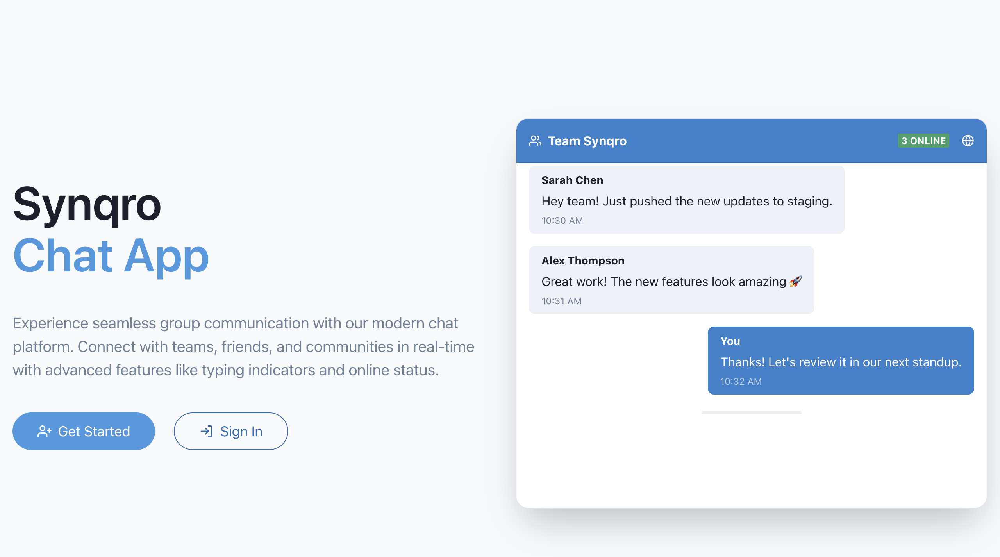
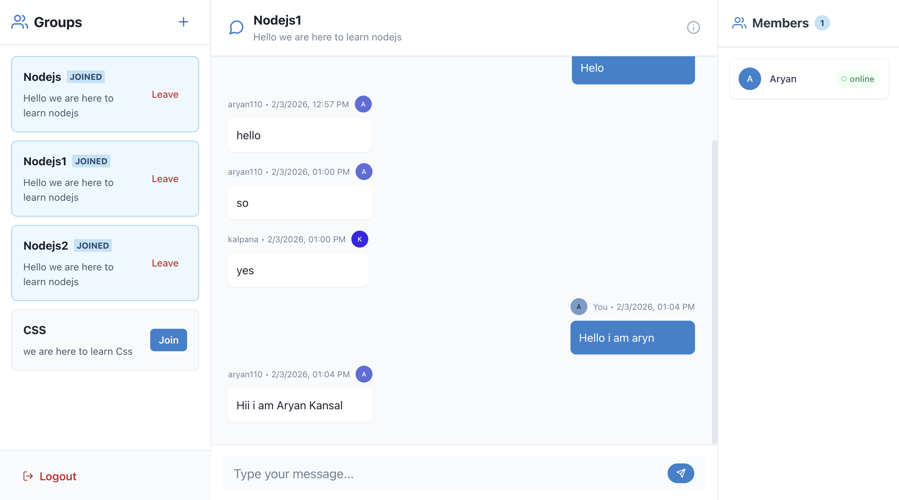
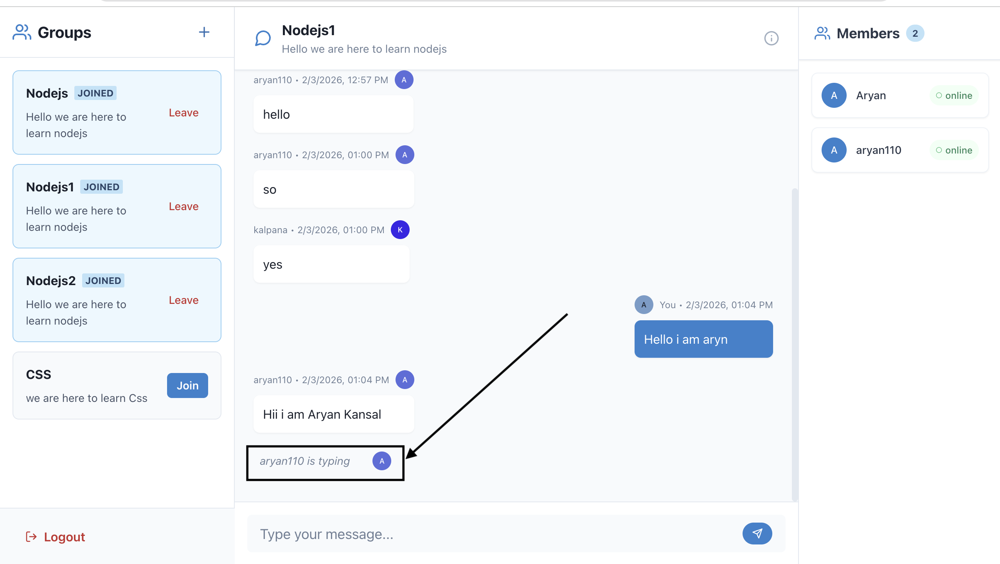
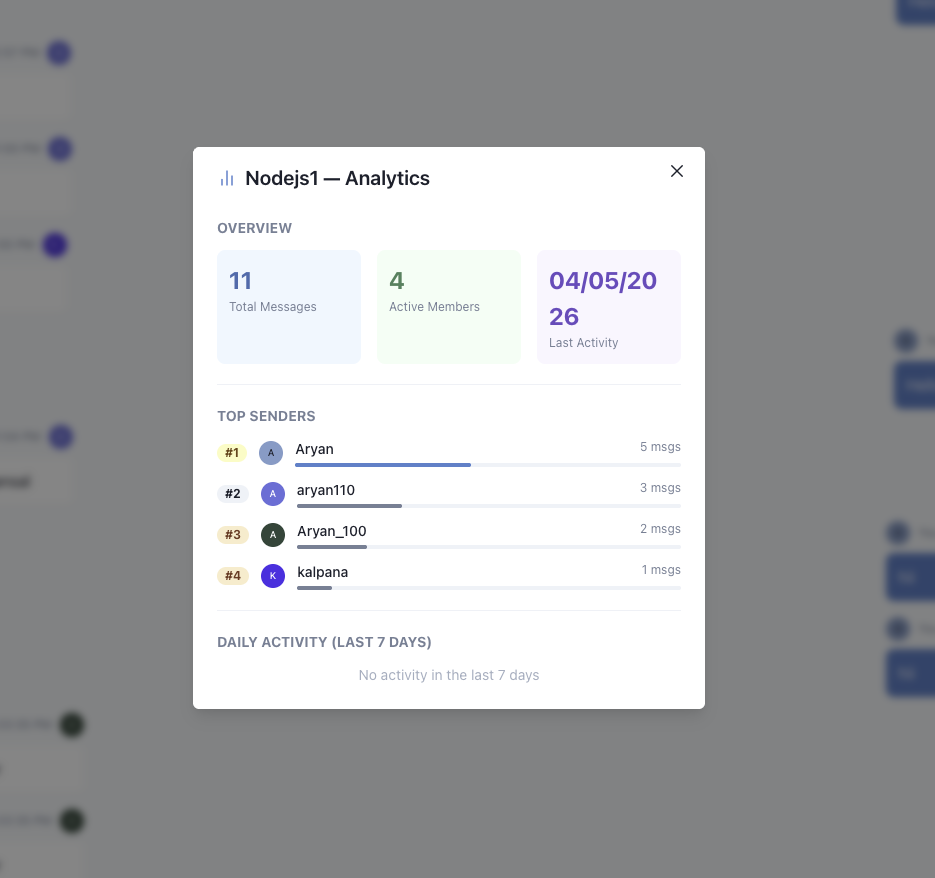
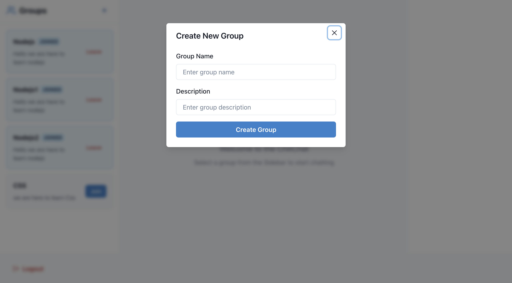
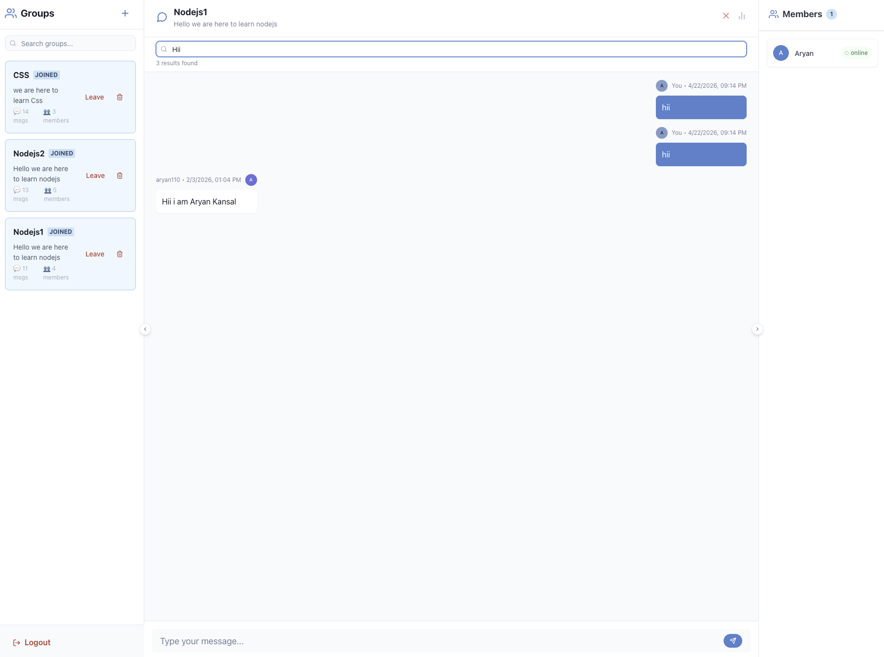

<div align="center">

# 💬 Synqro

**Production-Ready Real-time Group Chat | MERN Stack + WebSockets + Docker**

[](https://reactjs.org/)
[](https://nodejs.org/)
[](https://www.mongodb.com/)
[](https://socket.io/)
[](https://expressjs.com/)
[](https://www.docker.com/)
[](https://jwt.io/)
[](https://nginx.org/)

🚀 **[Live Demo](https://synqro.netlify.app)** · **[Backend API](https://chitchat-lihl.onrender.com)**

</div>

---

## 📸 Screenshots

<div align="center">
<table>
<tr>
<td><br/><b>Landing Page</b></td>
<td><br/><b>Real-time Chat</b></td>
</tr>
<tr>
<td><br/><b>Live Typing Indicator</b></td>
<td><br/><b>Aggregation Analytics</b></td>
</tr>
<tr>
<td><br/><b>Create Group (Admin)</b></td>
<td><br/><b>Full-Text Search</b></td>
</tr>
</table>
</div>

---

## ✨ Key Features

| Feature | Implementation Detail |
|---------|----------------------|
| **Real-time Messaging** | Bidirectional communication via Socket.IO WebSockets with room-based broadcasting |
| **Group Chat System** | Create, join, leave, and delete groups with role-based access control |
| **JWT Authentication** | Stateless auth with bcrypt password hashing and middleware-protected routes |
| **Typing Indicators** | Live "user is typing" feedback with debounced socket events |
| **Online Presence** | Real-time connected user tracking per group using socket rooms |
| **Full-Text Search** | MongoDB text indexes for searching across groups and messages |
| **Aggregation Analytics** | Group stats, top senders, and daily activity charts via MongoDB aggregation pipelines |
| **Responsive UI** | Chakra UI with collapsible panels and auto-collapse on viewport resize |
| **Dockerized Deployment** | Multi-stage Docker builds with docker-compose orchestration |

---

## 🏗️ Architecture

```
┌─────────────────────────────────────────────────────────────────┐
│                        Docker Compose                           │
│                                                                 │
│  ┌──────────────────┐   ┌──────────────────┐   ┌────────────┐  │
│  │   Frontend        │   │   Backend         │   │  MongoDB   │  │
│  │   (nginx:alpine)  │──▶│   (node:alpine)   │──▶│  (mongo:7) │  │
│  │                   │   │                   │   │            │  │
│  │  • React 18 SPA   │   │  • Express 5 API  │   │  • Text    │  │
│  │  • Vite build     │   │  • Socket.IO      │   │    Indexes │  │
│  │  • Gzip + caching │   │  • JWT + bcrypt   │   │  • Aggr.   │  │
│  │  • API proxy      │   │  • Mongoose ODM   │   │    Pipes   │  │
│  │  • WS proxy       │   │  • tini (PID 1)   │   │  • Volume  │  │
│  │                   │   │  • Non-root user  │   │    Mount   │  │
│  └───────:80─────────┘   └───────:3000───────┘   └────:27017──┘  │
│           │                                                      │
└───────────┼──────────────────────────────────────────────────────┘
            │
      localhost:8080
```

---

## 🛠️ Tech Stack

| Layer | Technologies |
|-------|-------------|
| **Frontend** | React 18, Vite, Chakra UI, Socket.IO Client, React Router, Axios |
| **Backend** | Node.js, Express 5, Socket.IO, Mongoose, JWT, bcrypt |
| **Database** | MongoDB — compound indexes, text indexes, aggregation pipelines |
| **DevOps** | Docker (multi-stage builds), Docker Compose, Nginx (reverse proxy) |
| **Deployment** | Netlify (frontend) · Render (backend) · MongoDB Atlas (database) |

---

## 🐳 Docker Setup

The entire application is containerized with optimized, production-grade Docker configurations.

### Quick Start (Docker)

```bash
git clone https://github.com/ARYAN149489/Synqro.git && cd ChitChat

# Start all services (MongoDB + Backend + Frontend)
docker compose up --build
```

Open **http://localhost:8080** — the full app is running.

### Docker Optimizations Applied

| Optimization | Detail |
|-------------|--------|
| **Multi-stage builds** | Separate dependency, build, and runtime stages for minimal image size |
| **Alpine base images** | `node:22-alpine` (~50MB) instead of full Node image (~350MB) |
| **Nginx for frontend** | Static files served via nginx:alpine (~25MB final image), no Node.js in production |
| **Layer caching** | `package.json` copied before source code — dependencies cached across rebuilds |
| **Production-only deps** | `npm ci --omit=dev` in backend — excludes devDependencies |
| **Non-root user** | Backend runs as `nodejs:1001` — follows security best practices |
| **tini init** | Proper PID 1 signal handling for graceful container shutdown |
| **Gzip compression** | Nginx compresses text, CSS, JS, JSON, SVG on the fly |
| **Immutable caching** | Vite's hashed assets cached for 1 year with `Cache-Control: immutable` |
| **Healthchecks** | MongoDB healthcheck ensures backend starts only after DB is ready |
| **Persistent volumes** | MongoDB data survives container restarts via named volumes |
| **Reverse proxy** | Nginx proxies `/api/*` and `/socket.io/*` to backend — single entry point |

### Services

| Service | Image | Port | Purpose |
|---------|-------|------|---------|
| `frontend` | nginx:1.27-alpine | 8080 → 80 | Serves React SPA + reverse proxies API/WebSocket |
| `backend` | node:22-alpine | 3000 | Express REST API + Socket.IO server |
| `mongo` | mongo:7 | 27017 | Database with persistent volume |

---

## 📁 Project Structure

```
ChitChat/
├── docker-compose.yml           # Orchestrates all 3 services
├── .dockerignore
│
├── backend/
│   ├── Dockerfile               # Multi-stage: deps → production (alpine + tini)
│   ├── server.js                # Express + Socket.IO + MongoDB setup
│   ├── socket.js                # Real-time event handling (rooms, typing, presence)
│   ├── middleware/              # JWT auth guard + admin role middleware
│   ├── models/                  # User, Group, Message schemas with indexes
│   └── routes/                  # REST API + text search + aggregation endpoints
│
└── frontend/
    ├── Dockerfile               # Multi-stage: deps → vite build → nginx serve
    ├── nginx.conf               # SPA routing, gzip, API/WebSocket reverse proxy
    └── src/
        ├── pages/               # Landing, Login, Register, Chat
        └── components/          # Sidebar, ChatArea, UsersList, PrivateRoute
```

---

## 🔌 API Endpoints

| Method | Endpoint | Description |
|--------|----------|-------------|
| POST | `/api/users/register` | Register new user |
| POST | `/api/users/login` | Login with JWT token |
| GET | `/api/groups` | Get all groups |
| POST | `/api/groups` | Create group (admin only) |
| GET | `/api/groups/search?q=` | Full-text search groups |
| GET | `/api/groups/stats` | Group analytics (aggregation) |
| POST | `/api/groups/:id/join` | Join a group |
| POST | `/api/groups/:id/leave` | Leave a group |
| DELETE | `/api/groups/:id` | Delete group (admin only) |
| GET | `/api/messages/:groupId` | Get group messages |
| POST | `/api/messages` | Send message |
| GET | `/api/messages/:groupId/search?q=` | Full-text search messages |
| GET | `/api/messages/:groupId/stats` | Chat analytics (aggregation) |

---

## 🗄️ MongoDB Features Used

**Indexes:** Single field · Compound · Multikey · Text indexes

**Aggregation Pipelines:** `$group` · `$lookup` · `$unwind` · `$project` · `$match` · `$sort` · `$limit` · `$addToSet` · `$dateToString` · `$size`

**Operators:** `$text` · `$search` · `$meta: textScore` · `$gte` · `$sum` · `$max` · `$min`

---

## ⚡ Local Development (without Docker)

```bash
# Clone
git clone https://github.com/ARYAN149489/Synqro.git && cd ChitChat

# Backend
cd backend && npm install && cp .env.example .env && npm run dev

# Frontend (new terminal)
cd frontend && npm install && cp .env.example .env && npm run dev
```

**Environment Variables:**

```env
# backend/.env
MONGO_URL=mongodb://localhost:27017/chitchat
JWT_SECRET=your_secret_key
PORT=3000
FRONTEND_URL=http://localhost:5173

# frontend/.env
VITE_BACKEND_URL=http://localhost:3000
```

Open **http://localhost:5173** and start chatting!

---

## 👨‍💻 Author

**Aryan Kansal** — Full Stack Developer

[](https://github.com/ARYAN149489)
[](https://linkedin.com/in/aryan-kansal)
[](mailto:aryankansal113@gmail.com)

---

<div align="center">

⭐ **Star this repo if you find it helpful!**

*Built with the MERN Stack + WebSockets + Docker · © 2025 Synqro*

</div>